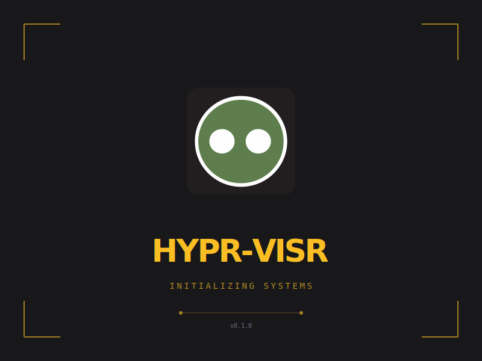
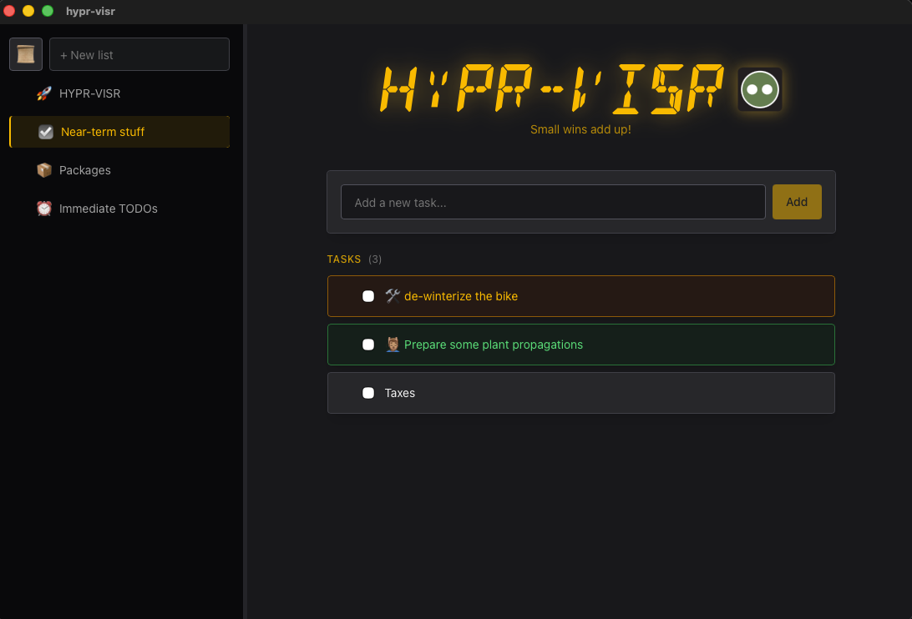
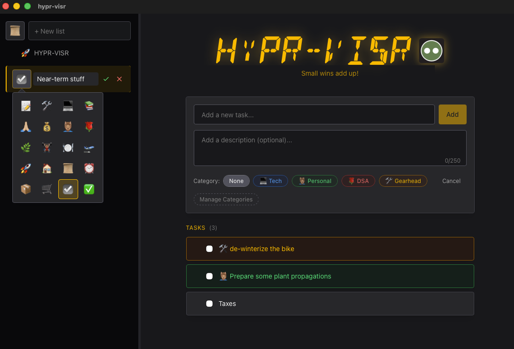
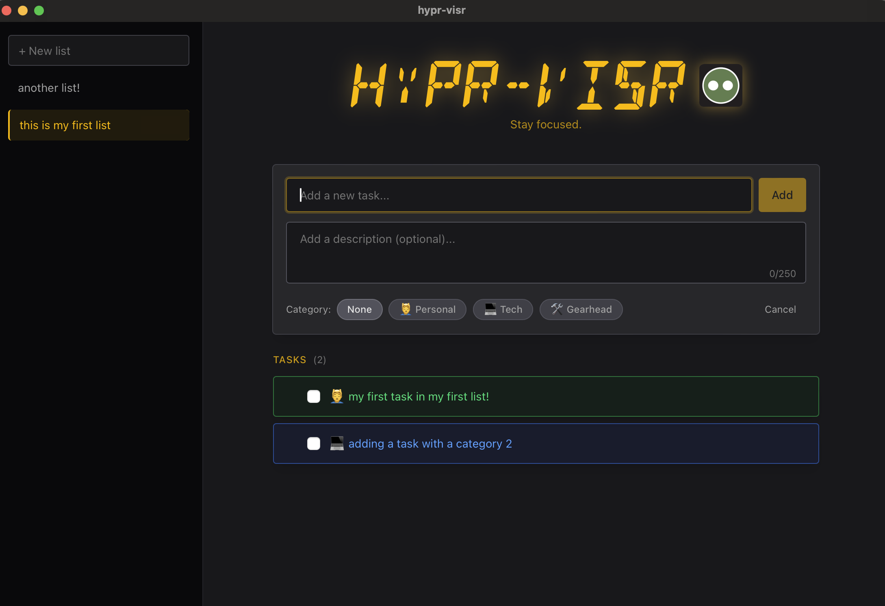

# hypr-visr

A local-first todo/task management desktop app built with Tauri and React.







## Features

- Task creation (categories, descriptions, etc)
- Drag-and-drop reordering
- Support for multiple lists
- Local data persistence

### Future Enhancements:
- Drag-and-drop support for lists
- Icons for lists
- Task filtering and/or search
- Add other tabs: Notes, Recipes, etc.
- Mobile support

## Tech Stack

### Core

- **[Tauri 2.0](https://tauri.app/)** - Desktop app framework with a Rust backend and web frontend. Provides native performance with a smaller footprint than Electron.
- **[React 19](https://react.dev/)** - UI library handling all interactivity and state management
- **[TypeScript](https://www.typescriptlang.org/)** - Type-safe JavaScript
- **[Vite](https://vitejs.dev/)** - Build tool and dev server
- **[Claude](https://claude.ai/code)** - AI used for guidance, code review, and content generation (like this README!)

### Styling

- **[Tailwind CSS 4](https://tailwindcss.com/)** - Utility-first CSS framework
- **[DSEG Font](https://www.keshikan.net/fonts-e.html)** - 14-segment display font for the retro-tech title aesthetic

### Functionality

- **[dnd-kit](https://dndkit.com/)** - Modern drag-and-drop toolkit for React. We use `@dnd-kit/core` and `@dnd-kit/sortable` for task reordering.

## Prerequisites

- [Node.js](https://nodejs.org/) (v18 or higher)
- [Rust](https://www.rust-lang.org/tools/install) (latest stable)
- Platform-specific dependencies for Tauri: [see Tauri prerequisites](https://tauri.app/start/prerequisites/)

## Getting Started

1. **Clone the repository**
   ```bash
   git clone https://github.com/valerbear/hypr-visr.git
   cd hypr-visr
   ```

2. **Install dependencies**
   ```bash
   npm install
   ```

3. **Run the development server**
   ```bash
   npm run tauri dev
   ```

   This starts both the Vite dev server and the Tauri desktop app with hot reloading.

## Project Structure

```
hypr-visr/
├── src/                    # React frontend
│   ├── App.tsx             # Main app component
│   ├── App.css             # Global styles and font imports
│   ├── components/
│   │   ├── ToDoList.tsx    # Task list with state management
│   │   ├── TaskItem.tsx    # Individual task with drag handle
│   │   └── TaskInput.tsx   # Task creation form
│   └── types.ts            # TypeScript types and category definitions
├── src-tauri/              # Rust backend
│   ├── src/
│   │   ├── main.rs         # Entry point
│   │   └── lib.rs          # Tauri commands (load/save tasks)
│   ├── Cargo.toml          # Rust dependencies
│   └── tauri.conf.json     # Tauri configuration
└── public/                 # Static assets (fonts, icons)
```

## Architecture

React handles all UI, state management, and business logic. Rust handles only persistence (reading/writing tasks to disk).

```
┌─────────────────────────────────────────┐
│                 REACT                   │
│  • Rendering and UI                     │
│  • Drag-and-drop (dnd-kit)              │
│  • Task CRUD operations                 │
│  • Category/color management            │
├─────────────────────────────────────────┤
│            invoke() / listen()          │
├─────────────────────────────────────────┤
│                 RUST                    │
│  • load_tasks() - read from disk        │
│  • save_tasks() - write to disk         │
└─────────────────────────────────────────┘
```

Tasks are stored as JSON at `~/.hypr-visr/tasks.json`.

## Available Scripts

| Command | Description |
|---------|-------------|
| `npm run tauri dev` | Start the app in development mode |
| `npm run tauri build` | Build the app for production |
| `npm run dev` | Start only the Vite dev server (no Tauri) |
| `npm run build` | Build only the frontend |

## Building for Production

```bash
npm run tauri build
```

This creates a distributable app bundle in `src-tauri/target/release/bundle/`.

## License

MIT
